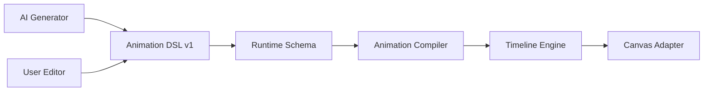

# Animation DSL Schema

> Schema version: `1.0`  
> Source: `src/animation/types.ts`  
> Runtime validation: `src/animation/schema.ts`

## 1. Purpose

Animation DSL is the product-facing animation protocol shared by three roles:

- AI generates a complete, deterministic animation description;
- users edit semantic presets or precise property keyframes;
- a future canvas adapter compiles the description into runtime values.

The DSL deliberately exposes neither Motion APIs nor Excalidraw types. Motion is an internal playback-clock dependency behind the runtime adapter. Element identifiers are opaque strings; binding those identifiers to real canvas elements belongs to the Excalidraw adapter layer.



The DSL and validation layers remain engine-neutral. Runtime and Excalidraw integration live behind dedicated adapters.

## 2. Design rules

### 2.1 JSON-first

Every protocol value is JSON serializable. The schema uses plain objects, arrays, strings, booleans, and finite numbers. Functions, class instances, engine pointers, DOM objects, Maps, and Sets are not valid DSL values.

### 2.2 Canonical units

| Concept | Unit |
| --- | --- |
| Timeline time | milliseconds (`atMs`, `durationMs`, `startMs`) |
| Position/distance/blur/shadow | canvas units, interpreted as CSS pixels at zoom 1 |
| Rotation | degrees |
| Scale | unitless, `1` is the base size |
| Opacity/path progress | normalized `0..1` |
| Frame rate | integer frames per second, `1..240` |

The future engine adapter is responsible for unit conversion. For example, it may convert milliseconds to seconds and degrees to radians.

### 2.3 Strict validation

The runtime schema rejects:

- unknown fields;
- missing required fields;
- non-finite numbers;
- invalid ranges;
- unordered or duplicate keyframe times;
- duplicate track/group/property IDs;
- duplicate properties within one track;
- missing group references and cyclic nested groups;
- finite content that exceeds track or project duration;
- random group staggering without a seed.

Validation does not normalize or mutate input. Defaults are applied later by the compiler.

### 2.4 Stable identity

Project, track, group, and element IDs must be semantic and stable. AI should prefer readable IDs such as `track-card-entrance` and `group-card`, not array positions. Names and descriptions are editable labels; IDs are references.

## 3. Root model: `AnimationProject`

```ts
type AnimationProject = {
  schemaVersion: "1.0";
  id: string;
  durationMs: number;
  frameRate: number;
  playback?: AnimationPlayback;
  metadata?: AnimationProjectMetadata;
  scenes?: AnimationScene[];
  groups?: AnimationGroup[];
  tracks: AnimationTrack[];
};
```

`durationMs` is the hard project range used by playback and deterministic export. `frameRate` is an authoring/export timebase, not an instruction to create a permanent render loop.

Recommended defaults when optional values are omitted:

| Field                                | Compiler default |
| ------------------------------------ | ---------------- |
| `playback.autoplay`                  | `false`          |
| `playback.rate`                      | `1`              |
| `playback.direction`                 | `normal`         |
| `playback.iterations`                | `1`              |
| `track.enabled` / property `enabled` | `true`           |
| `track.priority`                     | `0`              |
| `track.startMs`                      | `0`              |
| fill mode                            | `none`           |

Metadata can record AI provenance without affecting execution:

```json
{
  "title": "Risk dashboard intro",
  "source": "ai",
  "prompt": "Reveal the cards from left to right",
  "tags": ["dashboard", "entrance"]
}
```

## 4. `AnimationTrack`

A track targets exactly one element or one logical group and contains one or more of:

- `properties`: explicit low-level keyframes;
- `presets`: finite semantic effects;
- `loops`: repeating semantic effects.

```ts
type AnimationTrack = {
  id: string;
  target:
    | { type: "element"; elementId: string }
    | { type: "group"; groupId: string };
  name?: string;
  description?: string;
  enabled?: boolean;
  priority?: number;
  startMs?: number;
  durationMs?: number;
  fill?: "none" | "forwards" | "backwards" | "both";
  properties?: AnimationProperty[];
  presets?: AnimationPreset[];
  loops?: LoopAnimation[];
  group?: GroupAnimationOptions;
};
```

All child times are relative to `track.startMs`. A track-level `durationMs` clips its content. If omitted, its finite duration is inferred from its content; an infinite loop still stops at project `durationMs`.

### Conflict resolution

Presets and loops are compiler macros that expand into property channels. When more than one source writes the same target/property/time, the compiler must resolve it deterministically:

1. higher `track.priority` wins;
2. an element-target track wins over a group-expanded track at equal priority;
3. within one track, explicit `properties` win over `loops`, and `loops` win over `presets`;
4. a remaining tie is resolved by later track order in `project.tracks`.

Editors should warn about overlapping writes even though the result is deterministic.

## 5. `AnimationProperty`

Property names are stable external contracts. They are not JavaScript object paths and must not be interpreted with arbitrary property access.

### 5.1 Transform

| Property           | Value      | Semantics                            |
| ------------------ | ---------- | ------------------------------------ |
| `transform.x`      | number     | absolute or adapter-defined canvas X |
| `transform.y`      | number     | absolute or adapter-defined canvas Y |
| `transform.scale`  | number ≥ 0 | uniform scale                        |
| `transform.rotate` | number     | degrees                              |

### 5.2 Visual and text appearance

| Property | Value | Behavior |
| --- | --- | --- |
| `visual.opacity` | number `0..1` | continuous |
| `visual.strokeColor` | CSS-compatible color | continuous RGBA component interpolation |
| `visual.backgroundColor` | CSS-compatible color | continuous RGBA component interpolation |
| `visual.strokeWidth` | number >= 0 | continuous |
| `visual.roughness` | enum id `0 \| 1 \| 2` | discrete line-style state |
| `visual.roundness` | number `0..1` | continuous radius progress; legacy `"sharp"/"round"` input remains readable |
| `text.fontSize` | number > 0 | continuous |
| `visual.fillStyle` | `"hachure" \| "cross-hatch" \| "solid" \| "zigzag"` | discrete state |
| `visual.strokeStyle` | `"solid" \| "dashed" \| "dotted"` | discrete state |
| `text.fontFamily` | supported Excalidraw font-family id | discrete state |
| `text.textAlign` | `"left" \| "center" \| "right"` | discrete state |
| `text.verticalAlign` | `"top" \| "middle" \| "bottom"` | discrete state |

Canonical AI output should use `#RRGGBB` or `#RRGGBBAA`, even though validation accepts any non-empty color string so future adapters can support CSS color syntax. State properties jump exactly at their keyframe: they do not own an easing, interpolated segment, or timeline connector. Roundness is not a state property; the UI option labels write numeric `0/1` endpoints for a radius animation.

### 5.3 Element state

| Property | Value | Semantics |
| --- | --- | --- |
| `element.visibility` | `"visible" \| "hidden"` | discrete render and interaction presence state |

Visibility is a held state and is never interpolated. A hidden element remains in the persistent Excalidraw scene, but the runtime excludes it from painting, pointer hit testing, box selection, and select-all. Opacity is independent: `visual.opacity` may create a fade, but opacity alone must not be used as the semantic replacement for an entrance or exit.

```json
{
  "property": "element.visibility",
  "fill": "forwards",
  "keyframes": [
    { "atMs": 0, "value": "hidden", "hold": true },
    { "atMs": 1, "value": "visible", "hold": true }
  ]
}
```

### 5.4 Advanced

| Property | Value | Extra configuration |
| --- | --- | --- |
| `advanced.path` | progress `0..1` | `motionPath`, `orientToPath`, normalized `anchor` |
| `advanced.drawProgress` | progress `0..1` | render-only line, arrow, or free-draw reveal |
| `advanced.blur` | number ≥ 0 | blur radius |
| `advanced.shadow` | `AnimationShadow` | offset, blur, spread, color |

Paths use explicit polyline points, structured cubic Bezier segments, or an SVG path. See `docs/animation-system.md` for Bezier, draw, group stagger, and scene timeline examples.

```json
{
  "property": "advanced.path",
  "motionPath": {
    "type": "polyline",
    "points": [
      { "x": 80, "y": 120 },
      { "x": 320, "y": 180 },
      { "x": 560, "y": 80 }
    ]
  },
  "orientToPath": true,
  "anchor": { "x": 0.5, "y": 0.5 },
  "keyframes": [
    { "atMs": 0, "value": 0 },
    {
      "atMs": 1600,
      "value": 1,
      "easing": { "type": "preset", "name": "ease-in-out" }
    }
  ]
}
```

### 5.5 Keyframes

```ts
type AnimationKeyframe<T> = {
  atMs: number;
  value: T;
  easing?: AnimationEasing;
  hold?: boolean;
  label?: string;
};
```

`easing` belongs to the outgoing segment from the current keyframe to the next. `hold: true` keeps the current value until the next keyframe and takes precedence over easing. Keyframes must be sorted by strictly increasing `atMs`. The state properties listed in section 5.2 and `element.visibility` are always held and must not define easing. Continuous properties, including roundness and colors, may define easing and must not be forced to hold.

## 6. Easing system

The easing protocol is semantic and engine-independent.

### Preset

```json
{ "type": "preset", "name": "ease-out" }
```

Supported names:

- `linear`, `ease`, `ease-in`, `ease-out`, `ease-in-out`;
- `smooth`, `sharp`, `bounce`;
- `back-in`, `back-out`, `back-in-out`.

### Cubic Bezier

```json
{ "type": "cubic-bezier", "x1": 0.22, "y1": 1, "x2": 0.36, "y2": 1 }
```

`x1` and `x2` must be in `0..1`; Y values may overshoot.

### Steps

```json
{ "type": "steps", "count": 2, "position": "end" }
```

Useful for blink, discrete reveal, and state changes.

### Spring

```json
{
  "type": "spring",
  "mass": 1,
  "stiffness": 170,
  "damping": 18,
  "velocity": 0
}
```

An adapter may implement spring analytically or compile it to sampled keyframes. The DSL never exposes engine-specific handles.

## 7. `AnimationPreset`

Presets are semantic, finite macros. Users can keep them editable at the semantic level or expand them into property keyframes.

| Category   | Names                                           |
| ---------- | ----------------------------------------------- |
| `entrance` | `fade-in`, `slide-in`, `scale-in`, `pop-in`     |
| `exit`     | `fade-out`, `slide-out`, `scale-out`, `pop-out` |
| `emphasis` | `pulse`, `shake`, `bounce`, `highlight`         |
| `motion`   | `move-to`, `follow-path`, `orbit`               |
| `data`     | `count-up`, `progress`, `reveal`                |

Example:

```json
{
  "category": "entrance",
  "name": "slide-in",
  "atMs": 0,
  "durationMs": 500,
  "direction": "left",
  "distance": 48,
  "easing": { "type": "preset", "name": "ease-out" },
  "fill": "both"
}
```

Data presets are semantic instructions for a future adapter. A `count-up` preset, for example, does not assume that the target is an Excalidraw text element:

```json
{
  "category": "data",
  "name": "count-up",
  "atMs": 300,
  "durationMs": 1200,
  "from": 0,
  "to": 98.6,
  "format": {
    "decimals": 1,
    "suffix": "%",
    "useGrouping": true
  }
}
```

If a canvas adapter cannot execute a preset for a target, it must return a compiler diagnostic. It must not silently ignore the preset.

## 8. Group animation

Groups are protocol-level logical composition. They are independent of any canvas editor's native grouping model.

```json
{
  "id": "group-card",
  "name": "Metric card",
  "members": [
    {
      "type": "element",
      "elementId": "card-background",
      "role": "background"
    },
    {
      "type": "element",
      "elementId": "card-title",
      "role": "title"
    },
    {
      "type": "element",
      "elementId": "card-icon",
      "role": "icon"
    }
  ]
}
```

A group-target track can animate all members together or stagger them:

```json
{
  "id": "track-card-entrance",
  "target": { "type": "group", "groupId": "group-card" },
  "group": {
    "mode": "stagger",
    "eachMs": 90,
    "order": "by-role",
    "roleOrder": ["background", "title", "icon"]
  },
  "presets": [
    {
      "category": "entrance",
      "name": "fade-in",
      "atMs": 0,
      "durationMs": 420,
      "easing": { "type": "preset", "name": "ease-out" }
    }
  ]
}
```

Groups may contain nested groups. The runtime schema rejects missing group references and cycles. For random stagger order, `seed` is required so AI generation, editing, preview, and export produce the same order.

## 9. Loop animation

Loops are first-class semantic effects, not infinitely repeated arrays of keyframes.

### Pulse

```json
{
  "type": "pulse",
  "atMs": 800,
  "durationMs": 900,
  "iterations": "infinite",
  "direction": "alternate",
  "fromScale": 1,
  "toScale": 1.06,
  "easing": { "type": "preset", "name": "ease-in-out" }
}
```

### Blink

```json
{
  "type": "blink",
  "durationMs": 600,
  "iterations": 4,
  "minOpacity": 0.15,
  "maxOpacity": 1,
  "dutyCycle": 0.5
}
```

### Rotate

```json
{
  "type": "rotate",
  "durationMs": 2000,
  "iterations": "infinite",
  "fromDegrees": 0,
  "toDegrees": 360,
  "clockwise": true,
  "easing": { "type": "preset", "name": "linear" }
}
```

`durationMs` is one iteration's active duration. `delayMs` is the pause after each iteration. An infinite loop is bounded by the owning project's playback duration.

## 10. Complete project example

```json
{
  "schemaVersion": "1.0",
  "id": "project-dashboard-intro",
  "durationMs": 6000,
  "frameRate": 60,
  "playback": {
    "autoplay": false,
    "rate": 1,
    "direction": "normal",
    "iterations": 1
  },
  "metadata": {
    "title": "Dashboard card animation",
    "source": "ai",
    "tags": ["card", "data"]
  },
  "groups": [
    {
      "id": "group-card",
      "members": [
        { "type": "element", "elementId": "card-bg", "role": "background" },
        { "type": "element", "elementId": "card-title", "role": "title" },
        { "type": "element", "elementId": "card-icon", "role": "icon" }
      ]
    }
  ],
  "tracks": [
    {
      "id": "track-card-enter",
      "target": { "type": "group", "groupId": "group-card" },
      "startMs": 200,
      "priority": 0,
      "group": {
        "mode": "stagger",
        "eachMs": 100,
        "order": "by-role",
        "roleOrder": ["background", "title", "icon"]
      },
      "presets": [
        {
          "category": "entrance",
          "name": "slide-in",
          "atMs": 0,
          "durationMs": 500,
          "direction": "up",
          "distance": 24,
          "easing": { "type": "preset", "name": "ease-out" },
          "fill": "both"
        }
      ]
    },
    {
      "id": "track-icon-loop",
      "target": { "type": "element", "elementId": "card-icon" },
      "startMs": 1200,
      "priority": 10,
      "loops": [
        {
          "type": "pulse",
          "durationMs": 1000,
          "iterations": "infinite",
          "direction": "alternate",
          "fromScale": 1,
          "toScale": 1.08,
          "easing": { "type": "preset", "name": "ease-in-out" }
        }
      ]
    },
    {
      "id": "track-title-color",
      "target": { "type": "element", "elementId": "card-title" },
      "properties": [
        {
          "property": "visual.strokeColor",
          "fill": "forwards",
          "keyframes": [
            { "atMs": 0, "value": "#6B7280" },
            {
              "atMs": 900,
              "value": "#7C3AED",
              "easing": { "type": "preset", "name": "smooth" }
            }
          ]
        }
      ]
    }
  ]
}
```

## 11. Runtime schema API

The schema layer has no third-party runtime dependency.

```ts
import {
  animationProjectSchema,
  parseAnimationProject,
  safeParseAnimationProject,
} from "../src/animation/schema";

const project = parseAnimationProject(input); // returns project or throws

const result = safeParseAnimationProject(input);
if (!result.success) {
  console.error(result.error.issues);
}

const sameProject = animationProjectSchema.parse(input);
```

Individual schemas are exported for editors and AI streaming workflows:

- `animationEasingSchema`;
- `animationPathSchema`;
- `animationShadowSchema`;
- `animationPropertySchema`;
- `animationPresetSchema`;
- `loopAnimationSchema`;
- `animationGroupSchema`;
- `groupAnimationOptionsSchema`;
- `animationTrackSchema`;
- `animationProjectSchema`.

Errors contain structured issues:

```ts
type AnimationSchemaIssue = {
  code:
    | "invalid_type"
    | "invalid_value"
    | "missing_field"
    | "unknown_field"
    | "duplicate_id"
    | "duplicate_time"
    | "invalid_reference"
    | "cyclic_group"
    | "out_of_bounds";
  path: Array<string | number>;
  message: string;
};
```

## 12. AI generation contract

AI-generated documents should follow these additional rules:

1. Emit `schemaVersion: "1.0"` exactly.
2. Use stable readable IDs and only reference declared groups.
3. Emit integer millisecond times and sort keyframes by `atMs`.
4. Prefer presets for intent (`entrance`, `emphasis`, `data`) and explicit properties for exact authored values.
5. Use explicit easing rather than relying on compiler defaults for important motion.
6. Use canonical hex colors.
7. Add a deterministic seed for random staggering.
8. Keep finite content within project duration.
9. Do not invent property names, preset names, fields, or target types.
10. Validate with `safeParseAnimationProject()` before presenting or saving output.

## 13. Deliberate v1 boundaries

Version 1 does not define:

- runtime-engine controls, internal channel state, or adapter-private data;
- Excalidraw element shapes, selection state, group IDs, or history data;
- arbitrary JavaScript property paths or expressions;
- callbacks, events, audio, video encoding, or asset loading;
- non-uniform scale, 3D transforms, masks, or morphing;
- cross-property formulas or constraints;
- adapter-specific behavior for unsupported advanced/data properties.

Those capabilities can be added through a versioned schema migration. They must not be smuggled into v1 through unknown fields.
